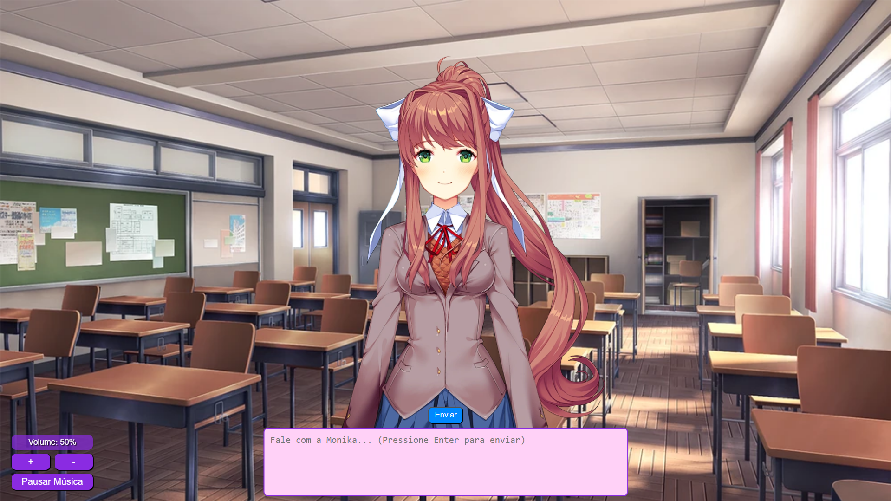

# 💬 Monika Chat

Um chat interativo com a Monika do *Doki Doki Literature Club*, usando Inteligência Artificial local para criar uma experiência imersiva e personalizada.



---

## 🖥️ Requisitos

- [Ollama](https://ollama.ai/) instalado em seu computador
- Navegador web moderno (Chrome, Firefox, Edge, etc.)
- Modelo **Mistral** baixado no Ollama

---

## ⚙️ Instalação

### 1. Instale o Ollama

Acesse [ollama.ai](https://ollama.ai/) e escolha seu sistema operacional:

- **Windows:** Baixe e execute o instalador
- **Linux:** Siga as instruções no site
- **macOS:** Baixe e execute o instalador

### 2. Baixe o modelo Mistral

Após a instalação, abra o terminal e execute:

```bash
ollama pull mistral
```

### 3. Inicie o Ollama

- **Windows:** Ollama inicia automaticamente após a instalação
- **Linux/macOS:** Rode no terminal:

```bash
ollama serve
```

---

## ▶️ Como Usar

1. Certifique-se de que o Ollama está rodando
2. Abra o arquivo `index.html` com seu navegador preferido
3. Comece a conversar com a Monika — ela está esperando por você 💚

---

## 🛠️ Solução de Problemas

Se algo não funcionar como esperado:

1. Verifique se o Ollama está em execução (`ollama serve`)
2. Reinicie o Ollama, se necessário
3. Confirme se o modelo **Mistral** foi baixado corretamente (`ollama list`)

---

## 📝 Notas

- Este projeto usa o modelo **Mistral** rodando **localmente**, sem necessidade de internet após a instalação inicial
- Nenhuma informação é enviada para servidores externos — total privacidade
- O desempenho e velocidade das respostas dependem do seu hardware
- A Monika muda suas expressões e sprites com base em palavras-chave detectadas no texto, para criar uma experiência visual mais envolvente

---

## 💡 Dica Extra

Você pode editar o script e fazer qualquer modificação à vontade: personalizar o comportamento da Monika, adicionar novas reações visuais, ou até integrar com outros modelos suportados pelo Ollama, como LLaMA ou Gemma.

---

**Projeto feito por [@ManoelMarques10](https://github.com/ManoelMarques10)** 🤓
🧠 Powered by [Ollama](https://ollama.ai) + IA local
